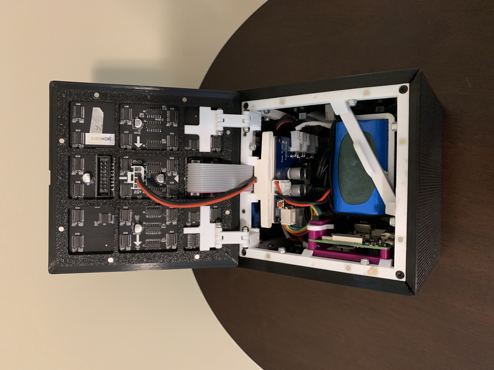

# The Cube - Mechanical

This directory contains the CAD files (Fusion 360) and
STL files for the cube's 3D printed parts.  The BOM
lists those and  the other misc. parts needed to build
a cube.

There are no assembly instructions, sorry.

