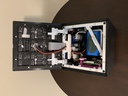

# LED Cube Mechanicals

This directory holds the mechanical parts of the cube
and its accessories.  It is organized into subdirectories.

* **Cube/** The cube.

 

* **Interlocking Stand/** Display stand made of three
interlocking pieces.  Breaks down for easy transport.

 

* **Display Stand/** Single-piece display stand.  Sturdier
than the interlocking stand but bulkier.

 

* **Display Stand/Travel Case/** a travel case for the
single-piece display stand.

 

Each subdirectory should have a README, a BOM, some Fusion 360 files, some STL files, and a picture or two.

## Versions

Each Fusion 360 file has a version number appended.
Fusion 360 exports do not include version history,
so earlier versions are not available, in general.

Some Fusion 360 files have both a generation and
a version.  Sometimes I just gave up on a design and started over.
When I did, I added a generation number.  *e.g.*, `Pi Connector Cover 4 v3.f3d`.
That's version 3 of the 4th try to design a connector cover.

Each STL file has a version number appended.  That
corresponds to the Fusion 360 version where that
body was last changed.  So the STL versions will
generally be less than the F360 version.  Version
64 of the cube uses v35 of the lid, for example.
